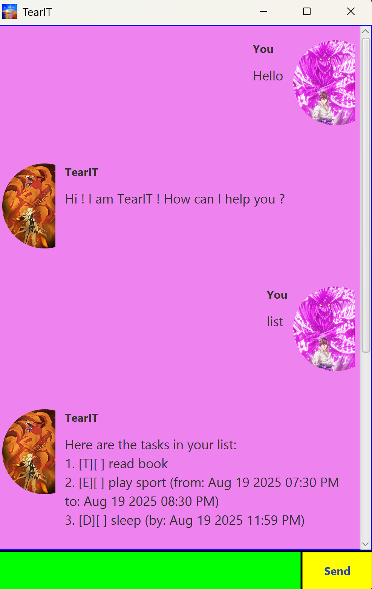

# TearIT User Guide



## Introduction

TearIT is a task management tool that helps users efficiently track and manage their to-do lists with deadlines, status updates, and search capabilities. Users can interact with TearIT using simple commands.

## Interactive Commands

### Greeting
To receive a friendly greeting, type:
```
hello
```
Expected outcome:
```
Hi ! I am TearIT ! How can I help you ?
```

### Exiting the Application
```
bye
```
Expected outcome:
```
Bye! Hope to see you again soon!
```

## Adding Tasks

### To-Do Tasks
To create a to-do task, use the following format:
```
todo TASK_NAME
```
Example:
```
todo Buy groceries
```
Expected outcome:
```
Got it! I've added this task:
[T][ ] Buy groceries
Now you have X tasks in the list.
```

### Deadlines
To add a deadline, use the following format:
```
deadline TASK_NAME /by DD-MM-YYYY HHMM
```
Example:
```
deadline Submit report /by 12-09-2024 2359
```
Expected outcome:
```
Got it! I've added this task:
[D][ ] Submit report (by: Sep 12 2024 11:59 PM)
Now you have X tasks in the list.
```

### Event Tasks
To add an event task, use the following format:
```
event TASK_NAME /from DD-MM-YYYY HHMM /to DD-MM-YYYY HHMM
```
Example:
```
event Sport /from 12-08-2024 1800 /to 13-08-2024 1800
```
Expected outcome:
```
Got it! I've added this task:
[E][ ] Sport (from: Aug 12 2024 06:00 PM to: Aug 13 2024 06:00 PM)
Now you have X tasks in the list.
```

## Task Management Features

### Listing All Tasks
To view all tasks currently in your list:
```
list
```
Expected outcome:
```
Here are the tasks in your list:
1. [T][ ] Buy groceries
2. [D][ ] Submit report (by: Sep 12 2024 11:59 PM)
3. [E][ ] Sport (from: Aug 12 2024 06:00 PM to: Aug 13 2024 06:00 PM)
```

### Marking a Task as Done
Use the `mark` command followed by the task number:
```
mark 2
```
Expected outcome:
```
Nice! I've marked this task as done:
[X] Task name
```

### Unmarking a Task
To mark a task as not done:
```
unmark 2
```
Expected outcome:
```
OK, I've marked this task as not done yet:
[ ] Task name
```

### Deleting a Task
To remove a task:
```
delete 3
```
Expected outcome:
```
Hey bro! I have removed task 3.
[T][ ] Read Book
Now you have X tasks in the list.
```

## Searching & Lookup Features

### Looking Up Tasks by Date
```
lookup 12-09-2024
```
Expected outcome:
```
Here are the tasks due on Sep 12 2024:
1. [D][ ] Submit report (by: Sep 12 2024 11:59 PM)
```

### Finding Tasks by Keywords
```
find report
```
Expected outcome:
```
Here are the matching tasks:
1. [D][ ] Submit report (by: Sep 12 2024 11:59 PM)
```

## Surprise Easter Egg
If you type:
```
chidori
```
Something unexpected happens! Give it a try!

# Notes
**The commands are case-insensitive and dates must follow given format for task creation (ie: DD-MM-YYYY HHMM)**

---
This guide provides an overview of TearIT's features and how to use them effectively. Happy task managing! 🚀


